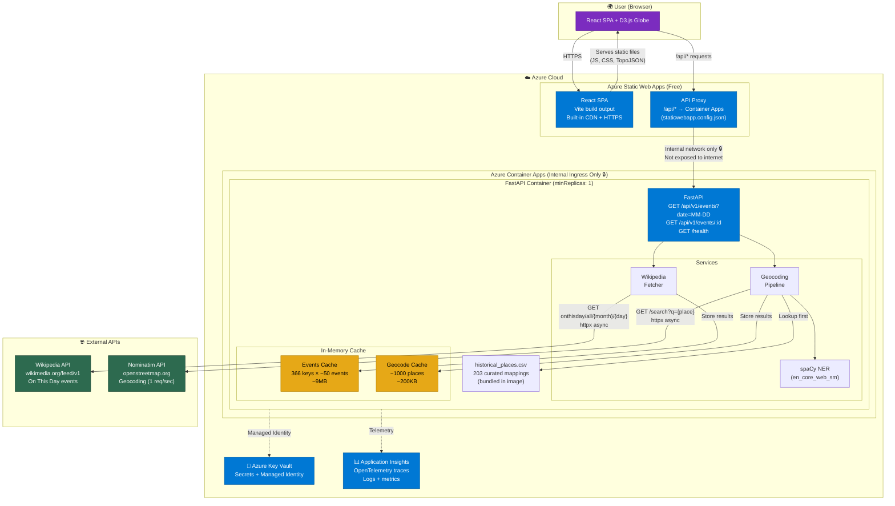
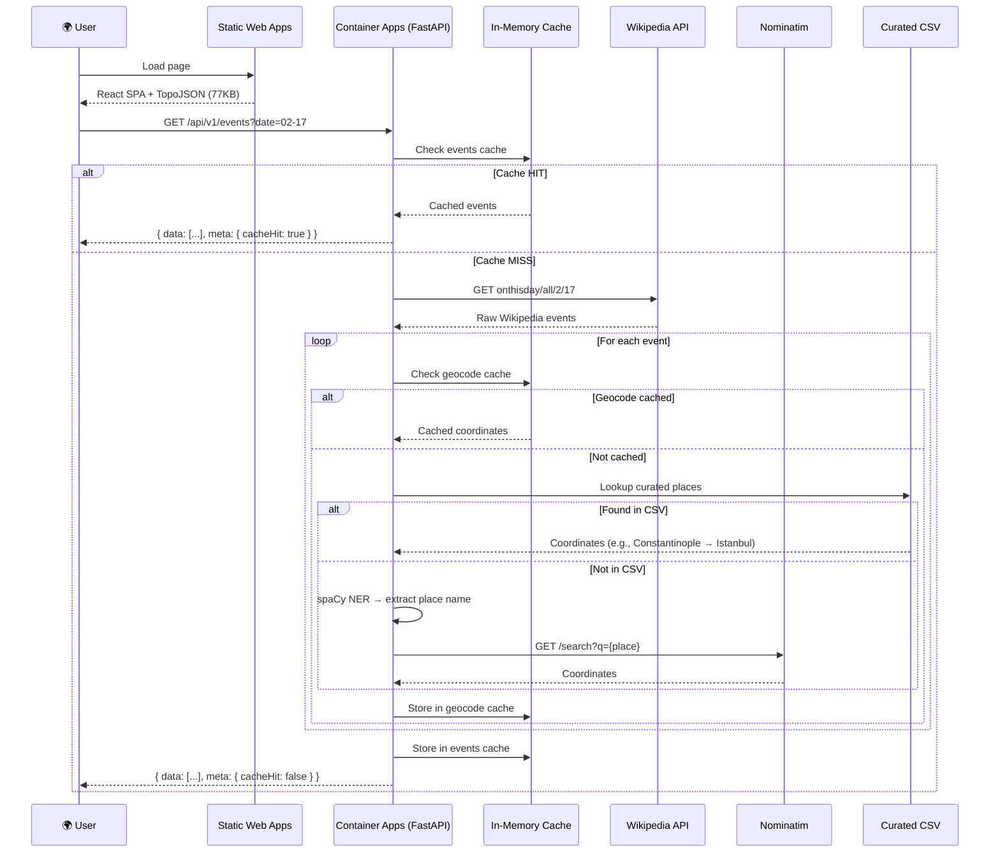

# Chrono Atlas — System Architecture

> Historical events only (no AI Foundry). Based on final deployment prerequisites.

## Architecture Diagram



## Request Flow



## Infrastructure Overview

```
┌──────────────────────────────────────────────────────────────┐
│                    AZURE CLOUD (~$5-7/mo)                     │
│                                                               │
│  ┌─────────────────────┐    ┌──────────────────────────────┐ │
│  │ Static Web Apps     │    │ Container Apps          🔒   │ │
│  │ (Free tier)         │    │ (Internal ingress only)      │ │
│  │                     │    │                              │ │
│  │ • React SPA         │    │ • FastAPI + uvicorn          │ │
│  │ • D3.js + TopoJSON  │    │ • spaCy NER model           │ │
│  │ • Built-in CDN      │───►│ • In-memory cache (~10MB)   │ │
│  │ • HTTPS             │proxy│ • Curated places CSV        │ │
│  │ • CI/CD from GitHub │/api│ • Health check endpoint      │ │
│  │                     │    │                              │ │
│  │ staticwebapp.config │    │ NOT exposed to internet      │ │
│  │ routes /api/* ──────┼───►│ Only accessible via SWA      │ │
│  └─────────────────────┘    └──────┬───────────┬───────────┘ │
│                                    │           │              │
│  ┌─────────────────────┐     ┌─────┘     ┌─────┘             │
│  │ Key Vault ($0)      │     │           │                   │
│  │ • Secrets           │     │           │                   │
│  │ • Managed Identity  │     │           │                   │
│  └─────────────────────┘     │           │                   │
│                              │           │                   │
│  ┌─────────────────────┐     │           │                   │
│  │ App Insights ($0)   │     │           │                   │
│  │ • OpenTelemetry     │     │           │                   │
│  │ • Logs + Metrics    │     │           │                   │
│  └─────────────────────┘     │           │                   │
└──────────────────────────────┼───────────┼───────────────────┘
                               │           │
                    ┌──────────▼──┐  ┌─────▼──────────┐
                    │ Wikipedia   │  │ Nominatim      │
                    │ API (free)  │  │ API (free)     │
                    │ • On This   │  │ • Geocoding    │
                    │   Day feed  │  │ • 1 req/sec    │
                    └─────────────┘  └────────────────┘
```
